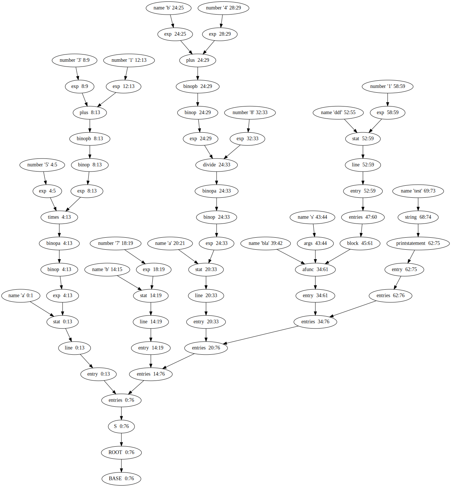

YAGGL: Yet Another GLL Parser
==================================
This library is designed to be a easy to use, light, C++ based GLL (general LL) parser, using fast __RE2__ regular expression matching.

Define Grammar
==============
Grammar rules are defined in their own grammar. A '|' denotes a choice between several matching rules:
'S = B | C' 
where 'S' can either be a 'B' or a 'C'. The 'B' and 'C' can then be defined later.

Text matching rules are defined the the RE2 grammar, the following defines 'B' matcher 1 or more 'a's.
'B = \'a+\''

    
Usage
=======
See yopl.cc for examples, the grammar result is returned in a ParseGraph which has convenience functions to walk through the results in several ways (breadth-first, depth-first or bottom-up). There is also easy functionality to output the graph as a 'dot' file that can be visualized using graphviz.
    
    
Building
=======
YOPL depends on RE2 from Google, a fast regular expression matcher. It can be installed throught the package manager on most distributions, e.g. on debian it can be installed using `sudo apt-get install libre2-dev`

Then build using the makefile:
`> make`

    
License
============    
License for all files in this repository: MPLv2.0, See LICENSE file

Author
======
Marijn Stollenga

Examples
=======
See test-files.

